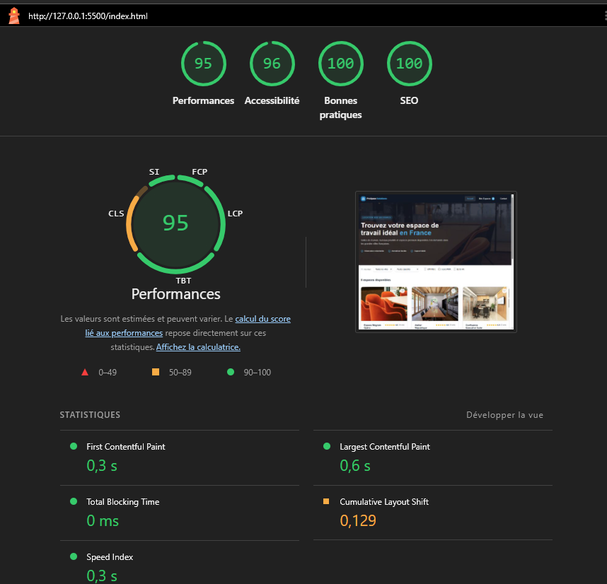
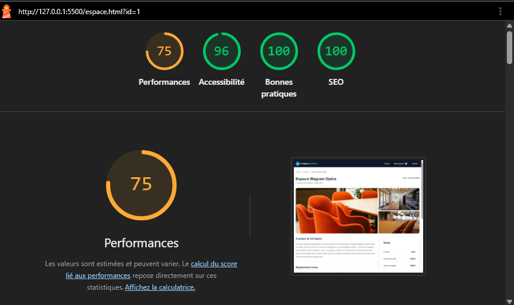
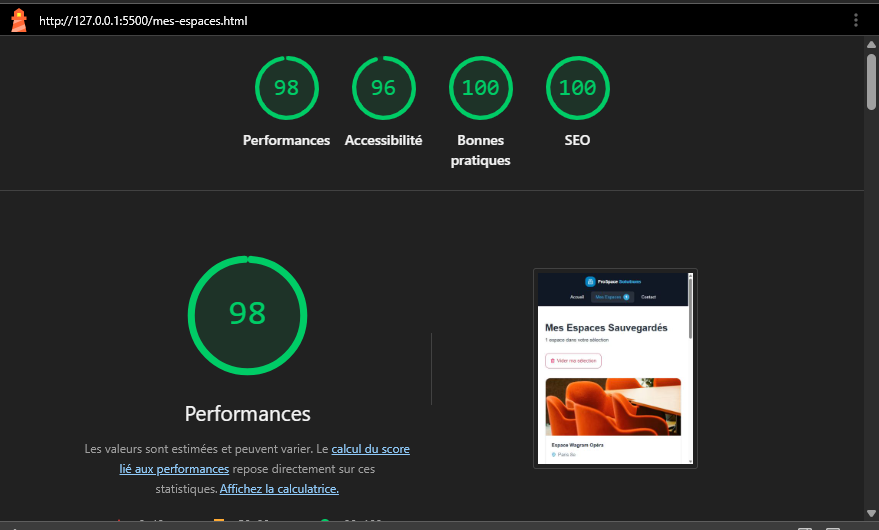
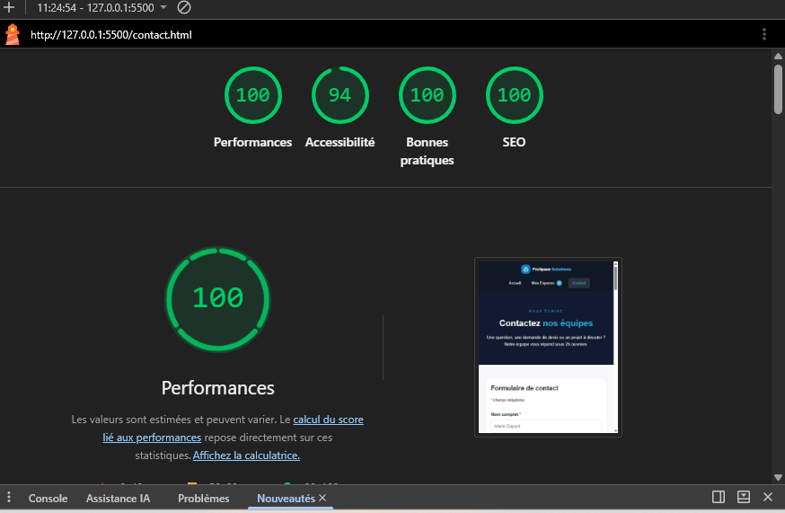

# ProSpace Solutions


ProSpace Solutions est un site vitrine B2B permettant de rechercher et de découvrir des espaces de travail professionnels disponibles dans plusieurs villes françaises.

Le projet a été réalisé dans le cadre d'une évaluation de développement front-end. Il met en œuvre une interface responsive, des données chargées depuis un fichier JSON et plusieurs fonctionnalités interactives développées en JavaScript natif.

## Fonctionnalités

- affichage dynamique de six espaces professionnels depuis un fichier JSON ;
- filtrage des espaces par ville, capacité et équipements ;
- mise à jour automatique du nombre de résultats ;
- affichage d'un message lorsqu'aucun espace ne correspond aux critères ;
- consultation d'une fiche détaillée grâce à un identifiant présent dans l'URL ;
- galerie, tarifs, capacité, configuration et équipements propres à chaque espace ;
- ajout et retrait d'espaces favoris ;
- conservation des favoris dans le `localStorage` du navigateur ;
- page dédiée aux espaces sauvegardés, avec suppression individuelle ou complète ;
- formulaire de contact avec validation côté client et messages d'erreur accessibles ;
- préremplissage de l'espace concerné lors d'une demande effectuée depuis une fiche ;
- carrousel de présentation de l'équipe ;
- gestion des états de chargement, d'erreur et d'identifiant invalide.

## Pages du site

| Page | Rôle |
| --- | --- |
| `index.html` | Accueil, recherche, filtres et liste des espaces |
| `espace.html?id=1` | Fiche détaillée dynamique d'un espace |
| `mes-espaces.html` | Consultation et gestion des favoris |
| `contact.html` | Formulaire de contact et présentation de l'équipe |
| `informations.html` | Page d'attente pour les liens informatifs non développés |

## Technologies utilisées

- HTML5 sémantique ;
- SCSS modulaire ;
- CSS et responsive design ;
- JavaScript ES6+ sans framework ;
- API Fetch pour charger les données JSON ;
- `localStorage` pour conserver les favoris ;
- npm et Sass pour la compilation des styles ;
- Git et GitHub pour le versionnement.

## Prérequis

- un navigateur web récent ;
- Node.js et npm pour modifier ou recompiler les fichiers SCSS ;
- un serveur local, nécessaire au chargement du fichier JSON avec `fetch`.

## Installation

Cloner le dépôt puis installer la dépendance Sass :

```bash
git clone https://github.com/Tepoesan/PROSPACE.git
cd PROSPACE
npm install
```

## Lancement du projet

Le site peut être lancé avec l'extension **Live Server** de Visual Studio Code :

1. ouvrir le dossier du projet dans Visual Studio Code ;
2. effectuer un clic droit sur `index.html` ;
3. sélectionner **Open with Live Server**.

Pour surveiller les modifications SCSS et régénérer automatiquement le fichier CSS :

```bash
npm run sass
```

Le point d'entrée du site est `index.html`.

## Utilisation

Depuis la page d'accueil, les listes déroulantes et les cases à cocher permettent de filtrer les espaces. Un clic sur une carte ouvre sa fiche détaillée.

Le bouton en forme de cœur ajoute ou retire un espace des favoris. La sélection est conservée dans le navigateur et reste accessible depuis la page **Mes Espaces**.

Depuis une fiche, le bouton de demande de devis ouvre la page de contact avec l'espace correspondant déjà sélectionné.

## Organisation du projet

```text
PROSPACE/
├── assets/
│   ├── css/                 # CSS compilé et source map
│   ├── icons/               # Icônes SVG
│   ├── images/              # Images du site et captures tests Lighthouse
│   ├── js/                  # Scripts JavaScript par page
│   ├── logo/                # Logo du site
│   └── scss/
│       ├── abstracts/       # Variables et mixins
│       ├── base/            # Reset et styles généraux
│       ├── components/      # Boutons, cartes et formulaires
│       ├── layout/          # En-tête et pied de page
│       ├── pages/           # Styles propres à chaque page
│       └── main.scss        # Point d'entrée SCSS
├── data/
│   └── espaces.json         # Données des espaces
├── contact.html
├── espace.html
├── index.html
├── informations.html
├── mes-espaces.html
└── package.json
```

## Données, Fetch API et URLSearchParams

Les informations des espaces sont centralisées dans `data/espaces.json`. Chaque entrée contient notamment un identifiant, une ville, une capacité, une note, une description, des équipements, des tarifs et une galerie d'images.

Les données sont récupérées côté client avec la Fetch API puis utilisées par JavaScript pour générer dynamiquement les cartes et le contenu des fiches espaces.

Lors de l'ouverture d'une fiche, `URLSearchParams` permet de récupérer le paramètre `id` présent dans l'URL :

`espace.html?id=1`

JavaScript utilise cet identifiant pour rechercher l'espace correspondant dans les données JSON et afficher son contenu. Si l'identifiant est absent ou invalide, un état d'erreur est affiché à l'utilisateur.

## SCSS et responsive design

Les styles suivent une architecture modulaire inspirée du pattern 7-1. Les variables, mixins, composants, éléments de mise en page et styles propres aux pages sont séparés dans différents fichiers, tous importés par `assets/scss/main.scss`.

L'interface s'adapte aux écrans mobiles, tablettes et ordinateurs. Les grilles, cartes, formulaires, galeries et blocs de contenu se réorganisent selon la largeur disponible.

## SEO et métadonnées

Chaque page possède une balise `<title>` et une métadonnée `<meta name="description">` adaptées à son contenu afin de fournir un titre et une description pertinents aux moteurs de recherche.

Sur la fiche d'un espace, ces métadonnées sont mises à jour dynamiquement en JavaScript à partir des informations récupérées dans le fichier JSON. Le titre et la description correspondent ainsi à l'espace actuellement consulté.

La structure HTML sémantique et la hiérarchie des titres participent également à la compréhension du contenu par les moteurs de recherche.

## Accessibilité et qualité

Le projet intègre notamment :

- une structure HTML sémantique ;
- des intitulés accessibles avec `aria-label` ;
- `aria-current` pour identifier la page active ;
- `aria-live` pour annoncer les résultats, erreurs et changements dynamiques ;
- des textes alternatifs pour les images ;
- une navigation au clavier sur les éléments interactifs ;
- des messages d'erreur associés aux champs du formulaire ;
- des états de favoris annoncés avec `aria-pressed`.

## Accessibilité et tests Lighthouse

Les différentes pages du projet ont été testées avec Google Lighthouse.
Les résultats obtenus dépassent le seuil demandé de 90 pour les critères
d'accessibilité et de SEO.

| Page | Performance | Accessibilité | Bonnes pratiques | SEO |
|---|---:|---:|---:|---:|
| Accueil | 95 | 96 | 100 | 100 |
| Fiche espace | 75 | 96 | 100 | 100 |
| Mes espaces | 98 | 96 | 100 | 100 |
| Contact | 100 | 94 | 100 | 100 |

### Accueil



### Fiche espace



### Mes espaces


### Contact


## Limites du projet

Ce projet est une démonstration front-end : il ne comporte ni serveur applicatif ni base de données. Le formulaire simule un envoi côté navigateur et les favoris restent enregistrés uniquement sur l'appareil utilisé.

## Auteur

Projet réalisé par **Tepoe VERROLLE** dans le cadre de sa formation de développeuse web full-stack avec WEBECOM.

Dépôt GitHub : [Tepoesan/PROSPACE](https://github.com/Tepoesan/PROSPACE)
